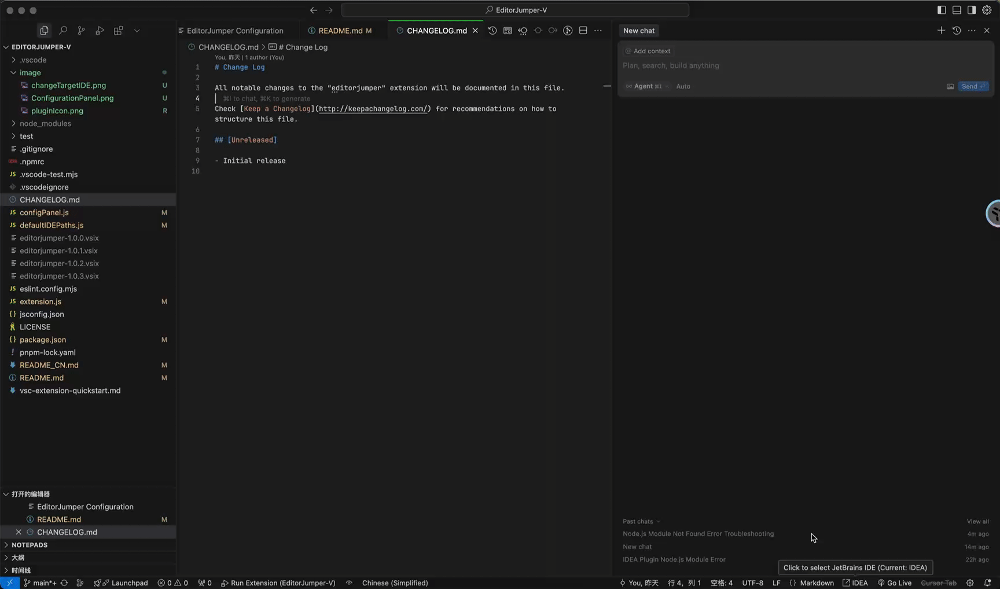
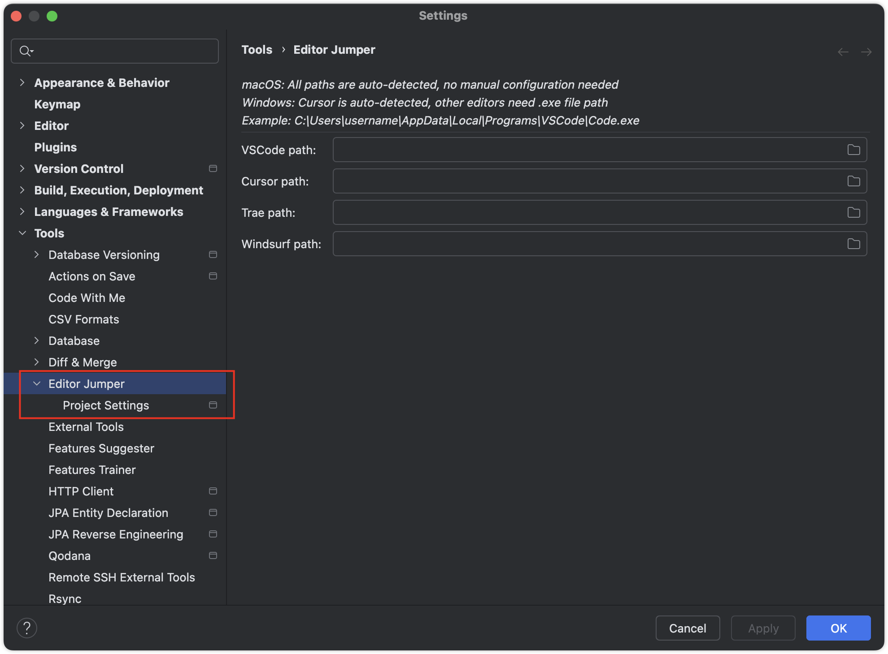

# Editor Jumper

  

  
  
  

## 🔍 Introduction

EditorJumper is a JetBrains IDE plugin that allows you to seamlessly jump between JetBrains IDE and other popular code editors (such as VS Code, Cursor, Trae, Windsurf, Void, Kiro, and Qoder). It maintains your cursor position and editing context, greatly improving development efficiency in multi-editor environments.

  

  

## 🌟 Features

- 🚀 **Seamless Editor Switching**
  - Quickly jump between JetBrains IDE and VS Code, Cursor, Trae, Windsurf, Void, Kiro, Qoder
  - Automatically positions to the same cursor location (line and column)
  - Perfectly maintains editing context without interrupting workflow
  - Workspace file support - all editors now support workspace files (.code-workspace) for multi-root projects

- ⚡ **Multiple Trigger Methods**
  - Right-click in editor - select "Open in [Editor Name]" (name updates based on selected editor)
  - Tools menu - select "Open in [Editor Name]" (name updates based on selected editor)
  - Standard mode jump- Alt+Shift+O / Option+Shift+O ()
  - Ultra-fast jump（mac）- Alt+Shift+P / Option+Shift+P

- 🎚️ **Easy Target Editor Selection**
  - Status bar widget - click the editor icon to select which editor to jump to

- 🍎 **Mac Exclusive Features**
  - Trae CN (国内版) checkbox option for Chinese users

## 💻 System Requirements

- Works with any JetBrains IDE (IntelliJ IDEA, WebStorm, PyCharm, etc.)
- Requires IDE version 2023 or newer

## 📥 Installation

1. Open Settings/Preferences in JetBrains IDE
2. Navigate to Plugins > Marketplace
3. Search for "EditorJumper"
4. Click the Install button
5. Restart the IDE to activate the plugin

## ⚙️ Configuration

1. Open Settings/Preferences in the IDE
2. Navigate to Tools > EditorJumper Settings
3. Configure the executable paths for each editor:
   - VS Code path
   - Cursor path
   - Trae path (with optional CN version checkbox on Mac)
   - Windsurf path
   - Void path
   - Kiro path
   - Qoder path
4. Select the default editor
5. Click Apply to save settings

> **Configuration Notes:**
> - macOS: No additional configuration needed for any editor
>   - Special: Trae CN checkbox option available for Chinese users
> - Windows:
>   - Cursor/Qoder: No configuration needed (uses system PATH)
>   - Other editors: Configure the .exe file path in Settings
>
> **Configuration Interface:**
> - Default Editor: Select which editor to use when using keyboard shortcuts
> - Editor Paths:
>   - macOS: All paths are auto-detected, no manual configuration needed
>   - Windows:
>     - Cursor/Qoder: Auto-detected through system PATH
>     - VS Code/Trae/Windsurf/Void/Kiro: Browse and select the .exe file location
>     - Example: `C:\Users\username\AppData\Local\Programs\VSCode\Code.exe`

## 🚀 Usage

### Via Keyboard Shortcut

| Usage Scenario | Alt+Shift+O / Option+Shift+O | Alt+Shift+P / Option+Shift+P          |
|-----------------|------------------------------|---------------------------------------|
| **On Project Folder** | Ultra-fast project opening | Ultra-fast project opening |
| **On Specific File** | Automatically opens project + file | Faster on Mac (requires project opened first, otherwise opens single file), no difference on Windows |

**Recommendations:**
- **Windows users**: Use Alt+Shift+O (sufficient for all needs)
- **Mac users**: Use Option+Shift+O, experienced users can use Option+Shift+P for faster experience

### Via Context Menu

1. Right-click in the editor
2. Select "Open in External Editor"

### Via Tools Menu

1. Click on Tools in the top menu bar
2. Select "Open in External Editor"

### Switch Target via Status Bar

1. Click on the jump icon in the IDE's bottom status bar
2. Select the editor you want to jump to from the dropdown menu
   
3. Use any of the trigger methods above (keyboard shortcut, right-click, or Tools menu) to perform the jump

## 🔄 Complementary Use

> Recommended to use with [EditorJumper-V](https://github.com/wanniwa/EditorJumper-V) to quickly return to JetBrains IDE from Cursor, VS Code, Trae, Windsurf, Void, Kiro, Qoder

## 🤝 Contribution

Pull Requests and Issues are welcome to help improve this plugin!

## 📄 License

This project is licensed under the MIT License - see the [LICENSE](LICENSE) file for details

## Star History

