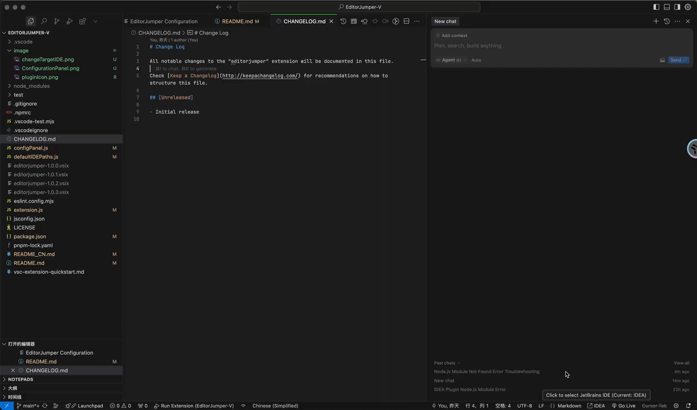
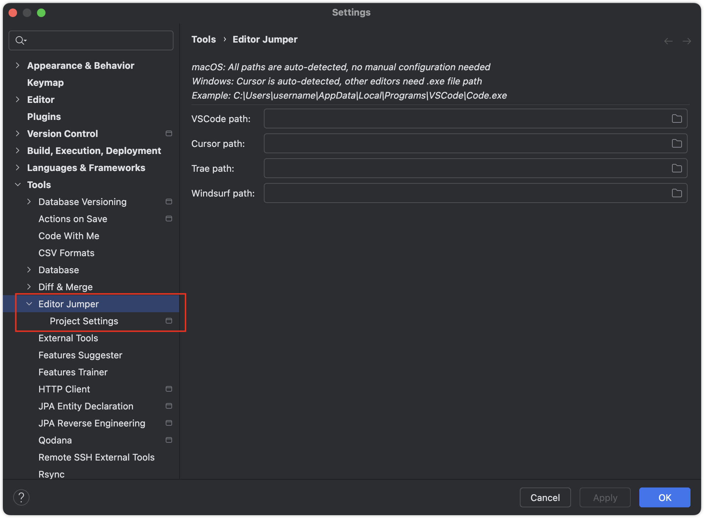
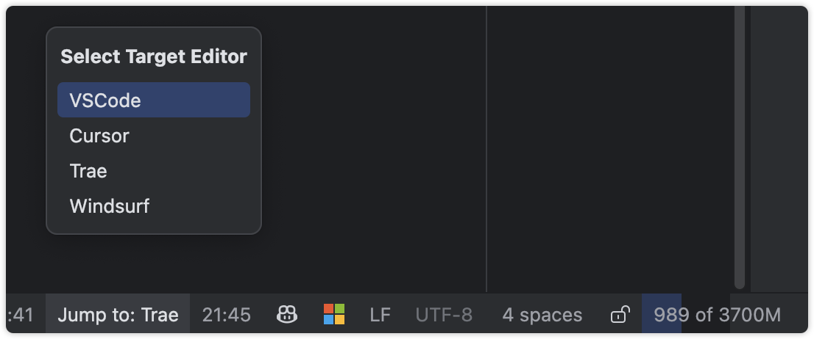

# Editor Jumper

  

  
  
  

## 🔍 简介

EditorJumper 是一个 JetBrains IDE 插件，允许您在 JetBrains IDE 和其他流行的代码编辑器（如 VS Code、Cursor、Trae、Windsurf、Void、Kiro、Qoder 和 JoyCode）之间无缝跳转。它能够保持光标位置和编辑上下文，大大提高了多编辑器环境中的开发效率。

  

  

## 🌟 功能特点

- 🚀 **无缝编辑器切换**
  - 快速在 JetBrains IDE 和 VS Code、Cursor、Trae、Windsurf、Void、Kiro、Qoder、JoyCode 之间跳转
  - 自动定位到相同的光标位置（行和列）
  - 完美保持编辑上下文，不中断工作流
  - 工作空间文件支持 - 所有编辑器现在都支持多根项目的工作空间文件 (.code-workspace)

- 🎯 **智能跳转行为**
  - 有文件打开时：打开相同的项目和文件，保持光标位置
  - 无文件打开时：直接在目标编辑器中打开项目
  - 兼容编辑器：支持多根项目的工作空间文件 (.code-workspace)

- ⚡ **多种触发方式**
  - 在编辑器中右击 - 选择"在 [编辑器名称] 中打开"（名称会根据选择的编辑器更新）
  - 工具菜单 - 选择"在 [编辑器名称] 中打开"（名称会根据选择的编辑器更新）
  - 快捷键 - Alt+Shift+O / Option+Shift+O
  - 极速跳转（mac）- Alt+Shift+P / Option+Shift+P

- 🎚️ **便捷的目标编辑器选择**
  - 状态栏小部件 - 点击编辑器图标选择要跳转到哪个编辑器

- 🍎 **Mac 专属功能**
  - Trae CN（国内版）勾选选项，专为中国用户提供

## 💻 系统要求

- 适用于任何 JetBrains IDE（IntelliJ IDEA、WebStorm、PyCharm 等）
- 需要 IDE 版本 2023 或更新版本

## 📥 安装

1. 在 JetBrains IDE 中打开设置/首选项
2. 导航到插件 > 市场
3. 搜索 "EditorJumper"
4. 点击安装按钮
5. 重启 IDE 以激活插件

## ⚙️ 配置

1. 在 IDE 中打开设置/首选项
2. 导航到工具 > EditorJumper 设置
3. 配置每个编辑器的可执行文件路径：
   - VS Code 路径
   - Cursor 路径
   - Trae 路径（Mac 上有可选的 CN 版本勾选框）
   - Windsurf 路径
   - Void 路径
   - Kiro 路径
   - Qoder 路径
   - JoyCode 路径
4. 选择默认编辑器
5. 点击应用保存设置

> **配置说明：**
> - macOS：所有编辑器无需额外配置
>   - 特殊：为中国用户提供 Trae CN 勾选选项
> - Windows：
>   - Cursor/Qoder：无需配置（使用系统 PATH）
>   - 其他编辑器：需在设置中配置 .exe 文件路径
>
> **配置界面：**
> - 默认编辑器：选择使用快捷键时要使用的编辑器
> - 编辑器路径：
>   - macOS：所有路径都自动检测，无需手动配置
>   - Windows：
>     - Cursor/Qoder：通过系统 PATH 自动检测
>     - VS Code/Trae/Windsurf/Void/Kiro：浏览并选择 .exe 文件位置
>     - 示例：`C:\Users\username\AppData\Local\Programs\VSCode\Code.exe`

## 🚀 使用方法

### 通过快捷键

| 使用场景 | Alt+Shift+O / Option+Shift+O | Alt+Shift+P / Option+Shift+P          |
|----------|------------------------------|---------------------------------------|
| **在项目文件夹上** | 极速打开项目 | 极速打开项目                                |
| **在具体文件上** |  自动打开项目+文件 | mac更快（但需要先打开项目，否则只会打开单个文件）,windows无差别 |

**使用建议：**
- **Windows 用户**：使用 Alt+Shift+O 即可（满足所有需求）
- **Mac 用户**：使用 Option+Shift+O，熟悉之后想要更快速的体验用 Option+Shift+P

### 通过上下文菜单

1. 在编辑器中右击
2. 选择"在外部编辑器中打开"

### 在状态栏更换跳转目标

1. 点击 IDE 底部状态栏中的跳转图标
2. 从下拉菜单中选择要跳转到的编辑器
   
3. 使用上述任一触发方式（快捷键、右击或工具菜单）执行跳转

## 🔄 配套使用

> 推荐与 [EditorJumper-V](https://github.com/wanniwa/EditorJumper-V) 配合使用，以便从 Cursor、VS Code、Trae、Windsurf、Void、Kiro、Qoder、JoyCode 快速返回 JetBrains IDE

## 🤝 贡献

欢迎提交 Pull Requests 和 Issues 来帮助改进这个插件！

## 📄 许可证

本项目采用 MIT 许可证 - 详情请参阅 [LICENSE](LICENSE) 文件

## 收藏历史

